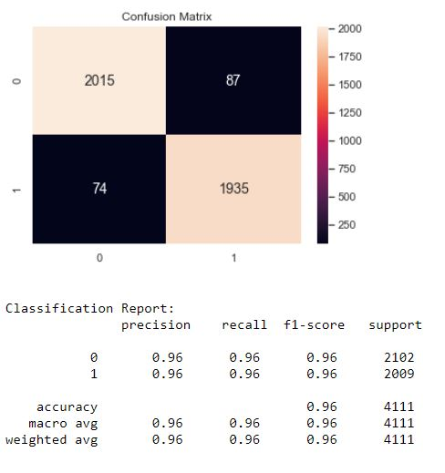

# Fake News Classifier using TfIdfVectorizer and PassiveAggressiveClassifier

This is a project I worked on while learning concepts of data science and machine learning. The goal here is to identify whether a "news" article is fake or fact. We will take a dataset of labeled public-messages and apply classification techniques with frequency vectorizer. We can later test the model for accuracy and performance on unclassified public-messages. Similar techniques can be applied to other NLP applications like sentiment analysis etc.

## Data

I am using dataset from [kaggle.com](https://www.kaggle.com/c/fake-news/data) which contains the following features:

- id: unique id for a news article
- title: the title of a news article
- author: author of the news article
- text: the text of the article; could be incomplete
- label: a label that marks the article as potentially unreliable
	- 1: unreliable
	- 0: reliable

## Model

We use TfIdf Vectorizer to convert our text strings to numerical representations and initialize a PassiveAgressive Classifier to fit the model. In the end, the accuracy score and confusion matrix tell us how well our model works.

### Term Frequency(Tf) - Inverse Document Frequency(Idf) Vectorizer
Tf-Idf Vectorizer is a common algorithm to transform text into meaningful representation of numbers. It is used to extract features from text strings based on occurrence.

We assume that higher number of repetitions of a word would mean greater importance in the given text. We normalize the occurrence of the word with the size of the document and hence call it term-frequency.
Numerical definition: 
`tf(w) = doc.count(w) / total words in the doc`

While computing term-frequency, each term is given equal weightage. There may be words which have high occurrence across the documents and hence would contribute less in deriving the meaning of document. Such words for example 'a', 'the' etc. might suppress the weights of more meaningful words. To reduce this effect, Tf is discounted by a factor called inverse document frequency.  
`idf(w) = log(total_number_of_documents / number_of-documents_containing_word_w)`

Tf-Idf is then computed by taking a product of Tf and Idf. More important words would get a higher tf-idf score.  
`tf-idf(w) = tf(w) * idf(w)`

### [Passive Aggressive Classifier](http://jmlr.csail.mit.edu/papers/volume7/crammer06a/crammer06a.pdf)
The passive-aggressive algorithms are a family of algorithms for large-scale learning.
Intuitively, passive signifies that if the classification is correct, we should keep the model, and, aggressive signifies that if the classification is incorrect, update the model to adjust to more misclassified examples. Unlike most others, it does not converge, rather it makes updates to correct the loss.

Detailed algortime and more details are present on the notebook.

## Results

The model outputs accuracy of ~96% which is decent enough. We have less than 1.5% false positive and false negative classification each. Check the confusion matrix and classification report below:

